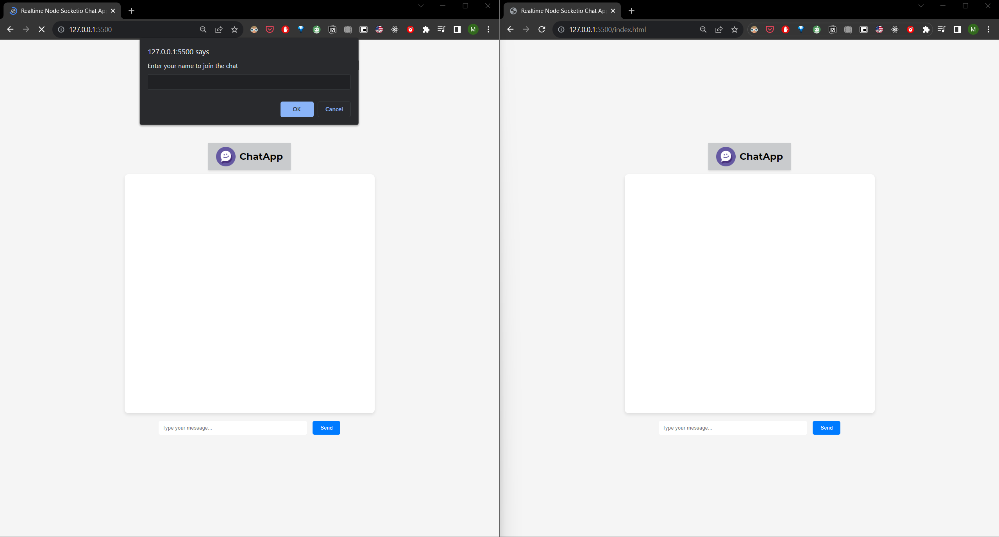
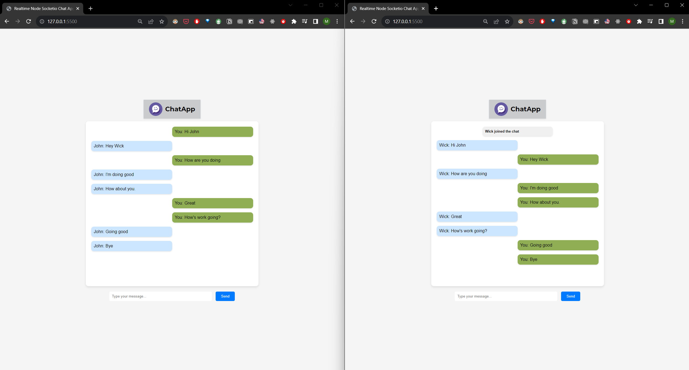
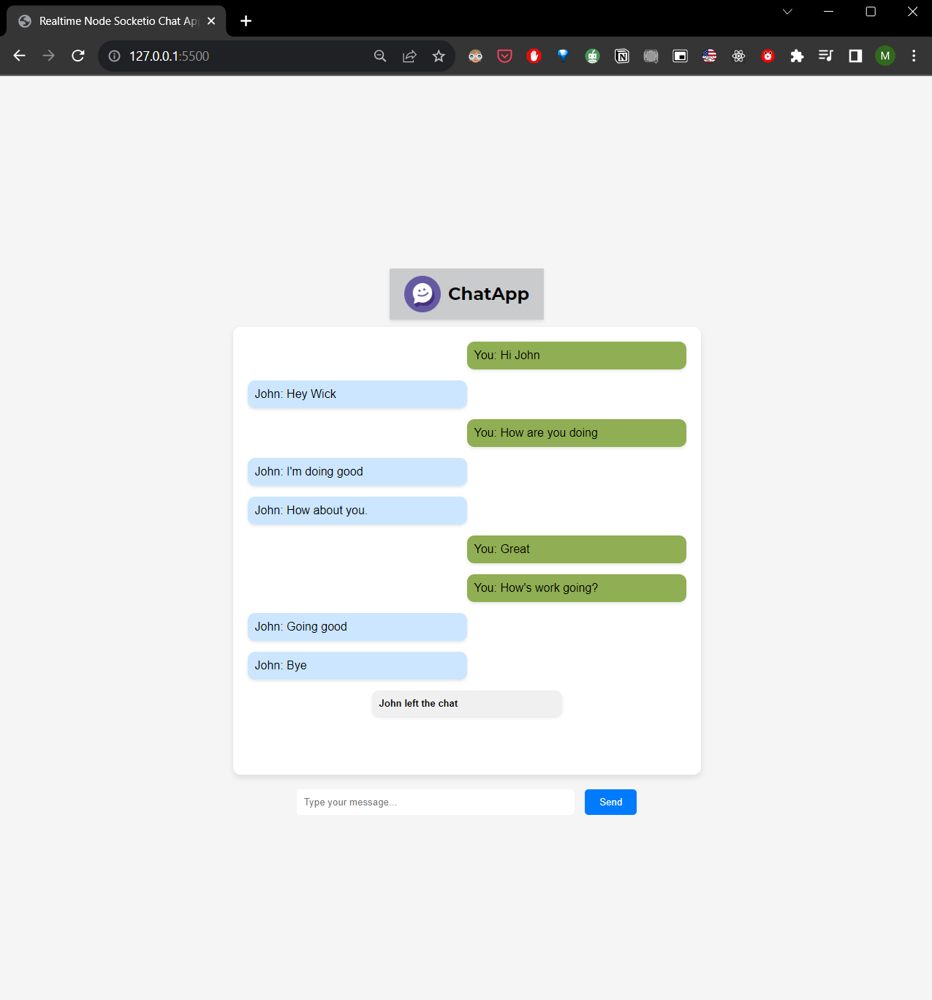

# Realtime Chat Application
A scalable and interactive realtime chatting application built using HTML, CSS, JavaScript, and Node.js. This application utilizes Socket.io for seamless two-way communication between users and the server, enabling multiple users to chat simultaneously. The frontend has a user-friendly chat window, and a message submission form. The dynamic frontend elements are managed through client-side JavaScript. The server-side JavaScript handles Socket IO connections, facilitating user join notifications, message broadcasts, and departure alerts. A user-friendly, responsive, and engaging chatting experience for modern web environments
## Technologies Used

## Technologies Utilized

- **Frontend**: HTML, CSS, JavaScript
- **Backend**: JavaScript, Node.js
- **Communication**: Socket.io for real-time, two-way connections

## How It Works

1. **User Interaction**: Upon entering, users are prompted to provide their name for identification.

2. **Realtime Chat**: The application seamlessly connects users in a chat room, enabling instant message exchange.

3. **Dynamic Updates**: Socket.io facilitates broadcasting of messages, ensuring all participants receive the conversation in real-time.

4. **Engaging Experience**: Users are informed when someone new joins or leaves the chat, promoting an engaging and interactive atmosphere.

## Installation

1. Clone the repository.
2. Navigate to the project directory.
3. Run `npm install` to install the required dependencies from nodeServer directory.
4. Start the server.
5. Access the application through your preferred web browser.

## Screenshots

### Start the chat

### Demo

### End the chat

